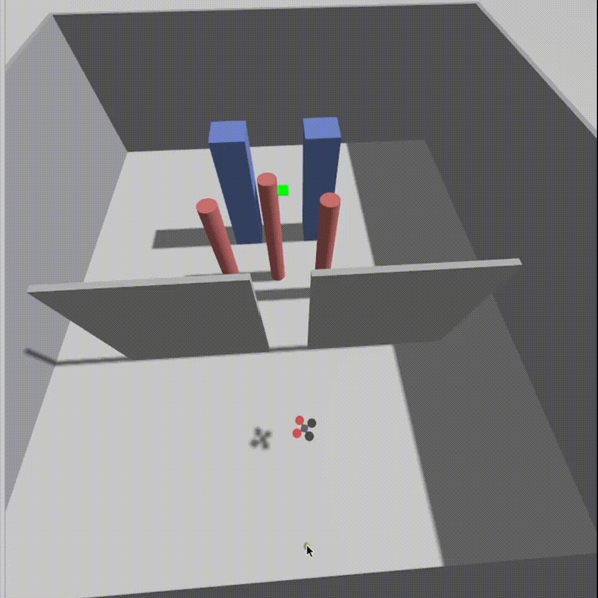

# Holonomic Dynamic Window Approach in a PX4 SITL + Gazebo Environment

> A holonomic take on the Dynamic Window Approach: reactive, LiDAR-driven
> obstacle avoidance for a simulated multirotor, using Gazebo to sim.

## Demo

### More demo runs are available in the [demo folder](holo_lab/demo/)
## WIP: wraping up to a package, adding Rviz demo

## Table of Contents

- [Requirements](#requirements)
- [Installation](#installation)
- [Usage](#usage)
- [Documentation](#documentation)
  - [Files](#files)
  - [Reference docs](#reference-docs)
- [Differences from standard DWA](#differences-from-standard-dwa)
- [References](#references)

## Requirements

- WSL2 + Ubuntu 22.04 (or native Ubuntu 22.04)
- ROS 2 Humble
- PX4-Autopilot v1.14.4 + Gazebo (Garden or Harmonic — must match the bridge)
- `ros_gz` bridge **built for your Gazebo version** — check `gz sim --version`
  first. The default `ros-humble-ros-gz-bridge` targets Fortress and will
  silently drop every message; this was a real bug, see [bug.md](archive/bug.md).
- Micro-XRCE-DDS-Agent, `px4_msgs`, `tmux`
- Python 3.10 with `numpy` (live node); `pybullet` for the offline prototype

## Installation

Full step-by-step setup (WSL2, ROS 2, PX4, the version-matched `ros_gz`
bridge, the workspace, and the extra Gazebo models) is in
**[installation.md](docs/installation.md)**.

The `x500_lidar_2d` / `lidar_2d_v2` models and the `dwa_test` world are missing
from PX4 v1.14.4; [`gz_extra/install.sh`](gz_extra/install.sh) copies them in:

```bash
cd ~/ws/src/HOLO-DWA
./gz_extra/install.sh ~/PX4-Autopilot
```

## Usage

One-shot launch (opens a 4-pane tmux session: PX4 SITL + Gazebo, XRCE-DDS
Agent, `ros_gz_bridge`, and the DWA node):

```bash
cd ~/ws/src/HOLO-DWA
./run.sh                # default goal (12.0, 0.0)
./run.sh 8.0 -3.0       # custom goal_x goal_y  (Gazebo world coords)
./run.sh kill           # tear the session down
```

Before the first run, PX4 needs Offboard-without-RC enabled once
(`NAV_DLL_ACT`, `COM_RCL_EXCEPT`, ...); the exact params and the manual
4-terminal launch are in [installation.md](docs/installation.md).

## Documentation

### files

| Path | Role |
|------|------|
| [`scanner.py`](scanner.py) | Live ROS 2 node: PX4 Offboard control + LiDAR-driven DWA navigation. |
| [`dwa_core.py`](dwa_core.py) | Holonomic DWA algorithm — the tuned `(vx, vy)` window search + scoring (no ROS deps). |
| [`run.sh`](run.sh) | One-shot tmux launcher for the full stack. |
| [`gz_extra/`](gz_extra/) | `x500_lidar_2d` model, airframe, and `dwa_test` world missing from PX4 v1.14.4 (`install.sh` copies them in); obstacle guide in [usage.md](gz_extra/usage.md). |
| [`holo_lab/`](holo_lab/) | Experiment harness + the full before→after tuning study (baseline → 15/15 runs, zero collisions). **Start here for the results** — [README](holo_lab/README.md). |
| [`docs/`](docs/) | Design & reference docs (linked under [Reference docs](#reference-docs)). |
| [`archive/`](archive/) | `dwa_logic.py` (offline PyBullet prototype), `bug.md` (`ros_gz` debug log). |

### Reference docs

- **[architecture.md](docs/architecture.md)** — data flow, ENU↔NED coordinate
  frames, the navigation state machine, the DWA loop, key parameters, and the
  simulation world.
- **[documentation.md](docs/documentation.md)** — class / function / `Config`
  parameter reference.
- **[installation.md](docs/installation.md)** — full step-by-step setup.
- **[discussion.md](docs/discussion.md)** — algorithm design trade-offs (local
  minima, the velocity-reward modes, the doorway problem).

Planner parameters live on `dwa_core.Config`, set for the live drone in the
`dwa_config` block near the top of [`scanner.py`](scanner.py) — edit there and
relaunch (`./run.sh`), no rebuild. The tuning story (how each value was chosen)
is in [holo_lab/EXPERIMENTS.md](holo_lab/EXPERIMENTS.md).

## Differences from standard DWA

HOLO-DWA keeps the DWA skeleton — a dynamic velocity window, the admissibility
mask, and short-horizon rollout — but differs from a textbook DWA in two ways.

**Search space: `(v, ω)` → `(vx, vy)`.** Classic DWA searches forward speed and
yaw rate `(v, ω)`, heading tied to the body — a car-like, non-holonomic motion
model. HOLO-DWA searches the planar velocity `(vx, vy)` directly and decouples
yaw, so the multirotor can strafe sideways through a gap while keeping its nose
(and the LiDAR's forward arc) on the goal.

**Scoring function.** On top of the standard heading / clearance / velocity
terms, the scoring is reworked:

- **Clearance** probes a fixed distance along the candidate's direction
  (speed-independent), instead of the minimum distance along the predicted
  trajectory — the standard measure is speed-coupled and quietly rewards
  creeping toward obstacles.
- **Terminal approach** uses a continuous attraction basin near the goal with a
  braking-curve target speed, so the drone arrives at a stoppable speed, rather
  than a hard bonus at the goal radius that lets a fast pass overshoot into an
  orbit.
- **Velocity** uses a blended reward (goal-directed component with a scalar
  floor) to avoid the diagonal drift a raw-speed reward causes in open space,
  while still sliding along walls to find gaps.

The pipeline also corrects the Gazebo z-up ↔ PX4 NED/FRD LiDAR scan handedness,
which a naive setup gets wrong.

> A formal head-to-head benchmark against a standard DWA of comparable compute
> is future work. How these scoring changes were derived and validated (the
> before→after study) is in [holo_lab/README.md](holo_lab/README.md) and
> [EXPERIMENTS.md](holo_lab/EXPERIMENTS.md).

## References

- D. Fox, W. Burgard, S. Thrun, *The Dynamic Window Approach to Collision
  Avoidance*, IEEE Robotics & Automation Magazine, 1997. — the original DWA;
  the heading / clearance / velocity scoring used here follows this.
- O. Brock, O. Khatib, *High-Speed Navigation Using the Global Dynamic Window
  Approach*, ICRA, 1999. — adds a global connectivity check to escape the
  local minima plain DWA gets stuck in (the wall/doorway traps in
  [discussion.md](docs/discussion.md)).
- P. Ögren, N. E. Leonard, *A Convergent Dynamic Window Approach to Obstacle
  Avoidance*, IEEE Transactions on Robotics, 2005. — conditions under which DWA
  provably reaches the goal.
- M. Seder, I. Petrović, *Dynamic Window Based Approach to Mobile Robot Motion
  Control in the Presence of Moving Obstacles*, ICRA, 2007. — extends DWA to
  dynamic obstacles.
- J. Borenstein, Y. Koren, *The Vector Field Histogram — Fast Obstacle
  Avoidance for Mobile Robots*, IEEE T-RA, 1991. — a reactive-avoidance
  predecessor for comparison.
- [PX4 ROS 2 User Guide](https://docs.px4.io/main/en/ros2/user_guide)
- [Gazebo Harmonic + ROS installation](https://gazebosim.org/docs/harmonic/ros_installation/)
- [gazebosim/ros_gz](https://github.com/gazebosim/ros_gz)
- [PX4/PX4-gazebo-models](https://github.com/PX4/PX4-gazebo-models)
- [eProsima Micro-XRCE-DDS-Agent](https://github.com/eProsima/Micro-XRCE-DDS-Agent)
